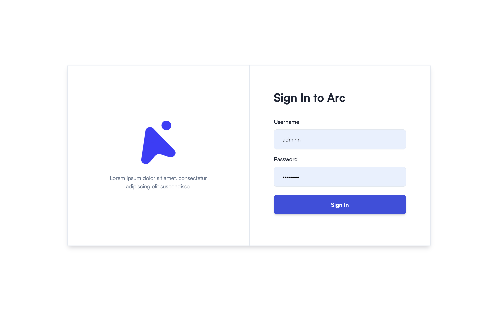
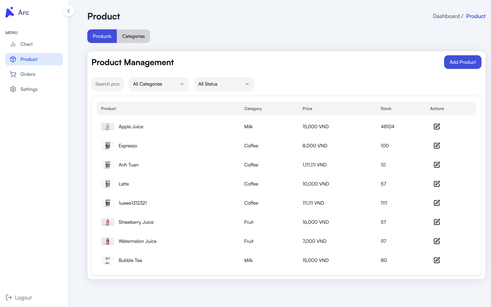
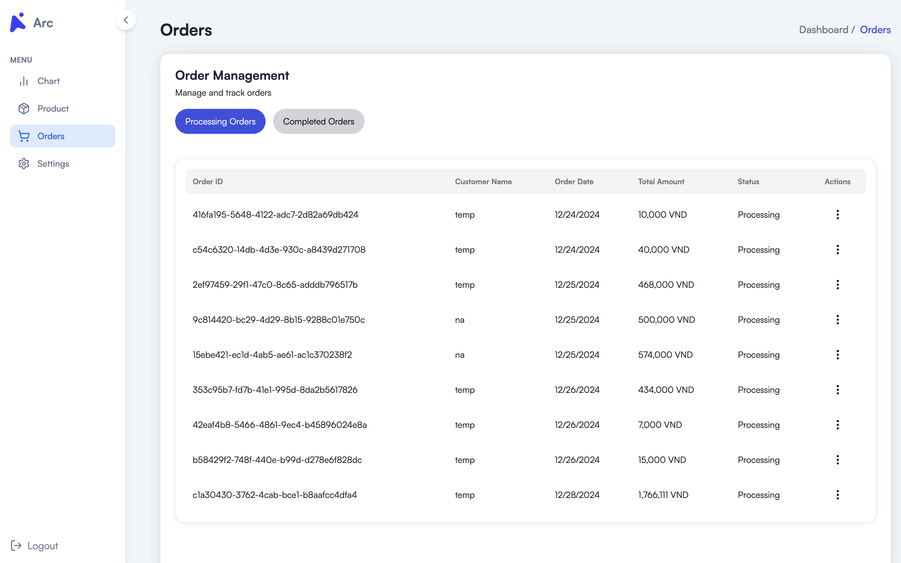
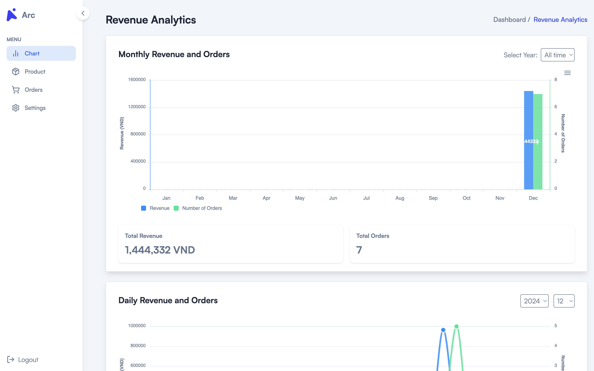

# Admin Dashboard - Bottled Water Vending

## Description

This is the admin dashboard for the Bottled Water Vending eCommerce platform. Built with **Next.js**, it provides administrators with tools to efficiently manage the website. Features include product management, order management, and revenue analytics.

---
## Related Repositories

This project is part of a larger ecosystem. Here are the related repositories:

- **Frontend (User Website):** [eCommerce Website - User Interface](https://github.com/TuananhDo0308/arccoffee.git)
- **Admin Dashboard:** [Admin Dashboard](https://github.com/TuananhDo0308/arccoffee-admin.git)
- **Backend (API Server):** [API Server](https://github.com/tquocan04/Online_Shopping.git)

---
## Preview

### 1. Sign in  


### 2. Product Management


### 3. Order Management


### 4. Revenue Analytics


---

### Features

- **Product Management:** Add, edit, and delete products.
- **Order Management:** View and update customer orders.
- **Revenue Analytics:** Monitor sales performance and revenue trends.
- **Responsive Design:** Optimized for desktop, tablet, and mobile devices.

---

## Table of Contents

- [Getting Started](#getting-started)
- [Prerequisites](#prerequisites)
- [Installation](#installation)
- [Configuration](#configuration)
- [Run the Project](#run-the-project)
- [Usage](#usage)
- [Tech Stack](#tech-stack)
- [License](#license)

---

## Getting Started

Follow these steps to set up the admin dashboard locally.

---

## Prerequisites

Ensure you have the following installed on your system:

- **Node.js:** Version 16 or higher.
- **npm** or **yarn** for package management.

---

## Installation

1. Clone the repository to your local machine:

   ```bash
   git clone https://github.com/TuananhDo0308/arccoffee-admin.git
   cd arccoffee-admin
   ```

2. Install the dependencies:

   ```bash
   npm install
   # or
   yarn install
   ```

---

## Configuration

1. API Endpoints:

   Ensure that all API endpoints are correctly defined in `src/utils/api-links.ts`. For example:

   ```typescript
   const authUrl = <your backend api url>;
   ```
   Ensure that all API endpoints are correctly defined in `src/utils/client-api.ts`. For example:

   ```typescript
   const clientUrl = <your frontend url>;
   ```


---

## Run the Project

### Development

1. Start the development server:
   ```bash
   npm run dev
   # or
   yarn dev
   ```

2. Open the application in your browser at `http://localhost:3000`.

### Production

1. Build the project:
   ```bash
   npm run build
   # or
   yarn build
   ```

2. Start the production server:
   ```bash
   npm run start
   # or
   yarn start
   ```

---

## Usage

Once the admin dashboard is running, administrators can:

- **Manage Products:** Add, edit, or remove product listings.
- **Track Orders:** View order details and update order statuses.
- **Analyze Revenue:** Access revenue and sales statistics.


---

## Tech Stack

The admin dashboard uses the following technologies:

- **Next.js:** React framework for building performant web applications.
- **Redux Toolkit:** State management for predictable application state.
- **Tailwind CSS:** Utility-first CSS framework for responsive design.
- **Axios:** For making HTTP requests.

---


## License

This project is licensed under the [MIT License](LICENSE).

---

This admin dashboard for bottled water vending is a perfect solution for managing products, orders, and revenue analytics efficiently. 🚀
